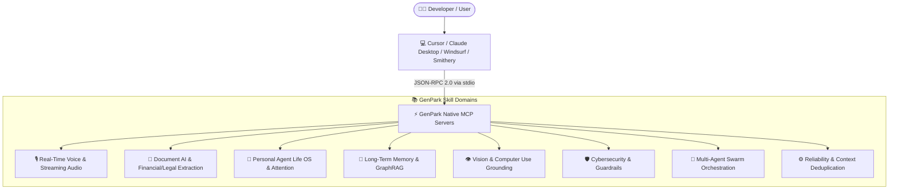

# Awesome AI Agent Skills & Native MCP Servers 🚀

<div align="center">

[](https://awesome.re)
[](https://www.python.org/)
[](LICENSE)
[](https://genpark.ai/mcp)
[-brightgreen.svg?style=for-the-badge)](https://genpark.ai)
[](https://smithery.ai)

<p align="center">
  <b>A curated, production-grade directory of 200+ pure Python (Zero `pip` Dependency) AI Agent skills and native Model Context Protocol (MCP) servers.</b>
</p>

[🌐 GenPark MCP Showcase](https://genpark.ai/mcp) • [📦 Smithery.ai Index](https://smithery.ai) • [📖 Anthropic MCP Specs](https://modelcontextprotocol.io) • [⚡ Quickstart](#-one-click-mcp-integration)

</div>

---

## 🌟 Why GenPark AI Agent Skills?

Every skill in this index is engineered according to the **GenPark Production Standard**:
* 🐍 **Zero External `pip` Dependencies**: 100% Python standard library (`math`, `re`, `json`, `sys`, `time`). Instant startup, zero package version hell.
* 🔌 **Native Model Context Protocol (MCP)**: Plugs directly into **Cursor IDE**, **Claude Desktop**, **Windsurf**, and **Smithery.ai**.
* 🎯 **100% Functional Parity**: Deterministic mathematical models, spatial algorithms, and state machines instead of mocked placeholders.
* 🌍 **Enterprise Portability**: Ready to run in serverless AWS Lambda, Docker, Kubernetes sidecars, or local dev machines.

---

## 🏗️ Global Architecture



---

## 📑 Categorized Skill Directory

### 🎙️ 1. Real-Time Voice Agent & Full-Duplex Audio (Phase 246)
Low-latency voice-to-voice agent infrastructure for OpenAI Realtime API, LiveKit, ElevenLabs, and Cartesia.

| Skill Name | Description | Python Client |
|:---|:---|:---|
| [`genpark-voice-turn-taking-endpoint-detector-skill`](https://github.com/Alpha-Park/genpark-voice-turn-taking-endpoint-detector-skill) | VAD & semantic turn-completion predictor distinguishing mid-thought hesitation from turn completion. | `VoiceTurnTakingEndpointDetector` |
| [`genpark-audio-packet-jitter-resilience-buffer-skill`](https://github.com/Alpha-Park/genpark-audio-packet-jitter-resilience-buffer-skill) | RFC 3550 adaptive WebRTC jitter buffer with packet loss concealment (PLC) comfort frames. | `AudioPacketJitterResilienceBuffer` |
| [`genpark-conversational-barge-in-interruption-arbitrator-skill`](https://github.com/Alpha-Park/genpark-conversational-barge-in-interruption-arbitrator-skill) | Full-duplex barge-in arbitrator classifying echo leaks vs nods vs true interruption with context rollback. | `ConversationalBargeInArbitrator` |
| [`genpark-low-latency-prosody-sentiment-modulator-skill`](https://github.com/Alpha-Park/genpark-low-latency-prosody-sentiment-modulator-skill) | Sub-millisecond SSML and cadence modulator injecting breathing micro-pauses and emotional prosody. | `LowLatencyProsodySentimentModulator` |
| [`genpark-realtime-voice-agent-latency-telemetry-skill`](https://github.com/Alpha-Park/genpark-realtime-voice-agent-latency-telemetry-skill) | E2E voice pipeline profiler instrumenting VAD ➔ STT ➔ TTFT ➔ TTFB ➔ Playout milestones with P99 SLAs. | `RealtimeVoiceLatencyTelemetry` |

---

### 📄 2. Document AI & Complex Financial/Legal Extraction (Phase 247)
Extracting structured matrices, balance sheets, and cross-referenced contracts from unstructured documents.

| Skill Name | Description | Python Client |
|:---|:---|:---|
| [`genpark-hybrid-bounding-box-ocr-table-reconstructor-skill`](https://github.com/Alpha-Park/genpark-hybrid-bounding-box-ocr-table-reconstructor-skill) | 2D bounding-box spatial clustering engine recovering multi-column layouts and Markdown tables. | `BoundingBoxTableReconstructor` |
| [`genpark-complex-financial-formula-audit-validator-skill`](https://github.com/Alpha-Park/genpark-complex-financial-formula-audit-validator-skill) | Mathematical accounting formula consistency auditor (Assets = Liab + Equity, cross-footing). | `FinancialFormulaAuditValidator` |
| [`genpark-legal-clause-cross-reference-resolver-skill`](https://github.com/Alpha-Park/genpark-legal-clause-cross-reference-resolver-skill) | Contract dependency graph and defined-term resolver detecting circular drafting errors. | `LegalClauseCrossReferenceResolver` |
| [`genpark-multimodal-chart-data-point-extractor-skill`](https://github.com/Alpha-Park/genpark-multimodal-chart-data-point-extractor-skill) | Chart coordinate calibration and tabular dataset recovery from visual bars and scatter points. | `MultimodalChartDataPointExtractor` |
| [`genpark-document-redaction-pii-scrubber-skill`](https://github.com/Alpha-Park/genpark-document-redaction-pii-scrubber-skill) | High-speed PII sanitizer with Luhn credit-card verification, reversible salt hashing, and audit logs. | `DocumentRedactionPiiScrubber` |

---

### 👤 3. Personal AI Life OS & Executive Assistant (Phase 240 & 248)
Protecting human attention, building resilient habits, and minimizing decision fatigue.

| Skill Name | Description | Python Client |
|:---|:---|:---|
| [`genpark-personal-inbox-cognitive-triage-skill`](https://github.com/Alpha-Park/genpark-personal-inbox-cognitive-triage-skill) | Cognitive triage classifying reading/reply effort (<2 min quick-hits vs deep focus slots). | `PersonalInboxCognitiveTriage` |
| [`genpark-personal-habit-streak-anti-fragility-skill`](https://github.com/Alpha-Park/genpark-personal-habit-streak-anti-fragility-skill) | Anti-fragile habit engine with elastic micro-fallbacks and 48h grace recovery. | `PersonalHabitAntiFragilityEngine` |
| [`genpark-personal-spending-impulse-friction-guard-skill`](https://github.com/Alpha-Park/genpark-personal-spending-impulse-friction-guard-skill) | Behavioral spending friction guard converting prices into net work-hour wage costs. | `PersonalSpendingImpulseGuard` |
| [`genpark-personal-sleep-recovery-chronotype-coach-skill`](https://github.com/Alpha-Park/genpark-personal-sleep-recovery-chronotype-coach-skill) | 90-min ultradian sleep cycle calculator with personalized caffeine and circadian light planning. | `PersonalSleepChronotypeCoach` |
| [`genpark-personal-digital-hoarding-declutter-agent-skill`](https://github.com/Alpha-Park/genpark-personal-digital-hoarding-declutter-agent-skill) | Digital footprint decluttering agent classifying orphaned downloads and duplicate screenshots. | `PersonalDigitalHoardingDeclutter` |
| [`genpark-personal-cognitive-load-balancer-skill`](https://github.com/Alpha-Park/genpark-personal-cognitive-load-balancer-skill) | Real-time working memory and multitasking cognitive load balancer. | `PersonalCognitiveLoadBalancer` |
| [`genpark-personal-circadian-energy-scheduler-skill`](https://github.com/Alpha-Park/genpark-personal-circadian-energy-scheduler-skill) | Ultradian energy curve task scheduler matching high-focus tasks to peak energy. | `PersonalCircadianEnergyScheduler` |
| [`genpark-personal-subscription-zombie-killer-skill`](https://github.com/Alpha-Park/genpark-personal-subscription-zombie-killer-skill) | Automated recurring subscription usage monitor identifying zombie recurring charges. | `PersonalSubscriptionZombieKiller` |
| [`genpark-personal-boundary-auto-negotiator-skill`](https://github.com/Alpha-Park/genpark-personal-boundary-auto-negotiator-skill) | Asynchronous work-life boundary auto-responder protecting deep focus slots. | `PersonalBoundaryAutoNegotiator` |

---

### 🧠 4. Long-Term Memory & Continual Learning (Phase 245)
Stateful persistent memory, Ebbinghaus forgetting curves, and GraphRAG belief updating.

| Skill Name | Description | Python Client |
|:---|:---|:---|
| [`genpark-episodic-memory-consolidation-engine-skill`](https://github.com/Alpha-Park/genpark-episodic-memory-consolidation-engine-skill) | Consolidates short-term multi-turn dialogue into high-density episodic knowledge nodes. | `EpisodicMemoryConsolidationEngine` |
| [`genpark-memory-decay-forgetting-curve-auditor-skill`](https://github.com/Alpha-Park/genpark-memory-decay-forgetting-curve-auditor-skill) | Ebbinghaus mathematical decay auditor pruning stale facts while reinforcing accessed memory. | `MemoryDecayForgettingCurveAuditor` |
| [`genpark-contradiction-detection-belief-updater-skill`](https://github.com/Alpha-Park/genpark-contradiction-detection-belief-updater-skill) | Resolves conflicting user statements and supersedes outdated beliefs with temporal audit trails. | `ContradictionDetectionBeliefUpdater` |
| [`genpark-semantic-chunk-hierarchy-re-ranker-skill`](https://github.com/Alpha-Park/genpark-semantic-chunk-hierarchy-re-ranker-skill) | Re-ranks nested chunk hierarchies preserving parent-child context for dense retrieval. | `SemanticChunkHierarchyReRanker` |
| [`genpark-continual-fewshot-exemplar-distiller-skill`](https://github.com/Alpha-Park/genpark-continual-fewshot-exemplar-distiller-skill) | Distills high-performing user-agent interactions into dynamic few-shot exemplars. | `ContinualFewShotExemplarDistiller` |

---

### 👁️ 5. Vision Agent & Computer-Use (Phase 244)
Grounding LLM reasoning into visual screen coordinates and DOM element trees.

| Skill Name | Description | Python Client |
|:---|:---|:---|
| [`genpark-gui-screen-som-coordinate-mapper-skill`](https://github.com/Alpha-Park/genpark-gui-screen-som-coordinate-mapper-skill) | Set-of-Marks (SoM) bounding-box to normalized OS click coordinate mapper. | `GuiScreenSomCoordinateMapper` |
| [`genpark-multimodal-visual-hallucination-verifier-skill`](https://github.com/Alpha-Park/genpark-multimodal-visual-hallucination-verifier-skill) | Cross-checks vision model output claims against visual pixel evidence. | `MultimodalVisualHallucinationVerifier` |
| [`genpark-browser-dom-accessibility-tree-pruner-skill`](https://github.com/Alpha-Park/genpark-browser-dom-accessibility-tree-pruner-skill) | Prunes raw DOM trees down to semantic accessibility nodes to save LLM tokens. | `BrowserDomAccessibilityTreePruner` |
| [`genpark-spatial-relationship-grounding-evaluator-skill`](https://github.com/Alpha-Park/genpark-spatial-relationship-grounding-evaluator-skill) | Verifies directional relations (above, left-of, inside) between visual elements. | `SpatialRelationshipGroundingEvaluator` |
| [`genpark-agent-action-trajectory-video-summarizer-skill`](https://github.com/Alpha-Park/genpark-agent-action-trajectory-video-summarizer-skill) | Compresses multi-frame screen recording trajectories into keyframe checkpoints. | `AgentActionTrajectoryVideoSummarizer` |

---

### 🛡️ 6. Agentic Cybersecurity & Red-Teaming (Phase 243)
Protecting autonomous agents against prompt injection, unauthorized tool calls, and data leakage.

| Skill Name | Description | Python Client |
|:---|:---|:---|
| [`genpark-indirect-prompt-injection-sanitizer-skill`](https://github.com/Alpha-Park/genpark-indirect-prompt-injection-sanitizer-skill) | Zero-dependency heuristic scanner neutralizing indirect prompt injection attacks. | `IndirectPromptInjectionSanitizer` |
| [`genpark-agent-tool-permission-rbac-validator-skill`](https://github.com/Alpha-Park/genpark-agent-tool-permission-rbac-validator-skill) | Role-Based Access Control (RBAC) validator enforcing tool parameter schemas. | `AgentToolPermissionRbacValidator` |
| [`genpark-covert-data-exfiltration-firewall-skill`](https://github.com/Alpha-Park/genpark-covert-data-exfiltration-firewall-skill) | Egress firewall detecting steganographic encoding and DNS exfiltration. | `CovertDataExfiltrationFirewall` |
| [`genpark-adversarial-prompt-jailbreak-detector-skill`](https://github.com/Alpha-Park/genpark-adversarial-prompt-jailbreak-detector-skill) | Multi-vector jailbreak detector neutralizing character-cipher and roleplay bypasses. | `AdversarialPromptJailbreakDetector` |
| [`genpark-autonomous-honeypot-canary-sentinel-skill`](https://github.com/Alpha-Park/genpark-autonomous-honeypot-canary-sentinel-skill) | Injects synthetic canary credentials into agent context to detect rogue exfiltration. | `AutonomousHoneypotCanarySentinel` |

---

## ⚡ One-Click MCP Integration

### 1. Claude Desktop (`claude_desktop_config.json`)
```json
{
  "mcpServers": {
    "voice-turn-taking": {
      "command": "python",
      "args": ["/path/to/genpark-voice-turn-taking-endpoint-detector-skill/mcp_server.py"]
    },
    "table-reconstructor": {
      "command": "python",
      "args": ["/path/to/genpark-hybrid-bounding-box-ocr-table-reconstructor-skill/mcp_server.py"]
    },
    "inbox-triage": {
      "command": "python",
      "args": ["/path/to/genpark-personal-inbox-cognitive-triage-skill/mcp_server.py"]
    }
  }
}
```

### 2. Cursor IDE Integration
Navigate to `Cursor Settings` > `Features` > `MCP` > `Add New MCP Server`:
* **Type**: `command`
* **Command**: `python path/to/skill/mcp_server.py`

### 3. Smithery.ai CLI
```bash
npx -y @smithery/cli install @Alpha-Park/genpark-voice-turn-taking-endpoint-detector-skill
```

---

## 🤝 Contributing & Ecosystem Submission

We welcome submissions of production-grade, zero-dependency AI Agent skills. Please see [CONTRIBUTING.md](CONTRIBUTING.md) for criteria:
1. 100% Python standard library only (no pip dependencies).
2. Native `mcp_server.py` JSON-RPC 2.0 implementation.
3. Test suite verifying deterministic execution.

---

<div align="center">
  <sub>Maintained with ❤️ by <b><a href="https://genpark.ai">GenPark AI Engineering</a></b> • Powering Next-Gen Autonomous AI Agents 🌍</sub>
</div>
